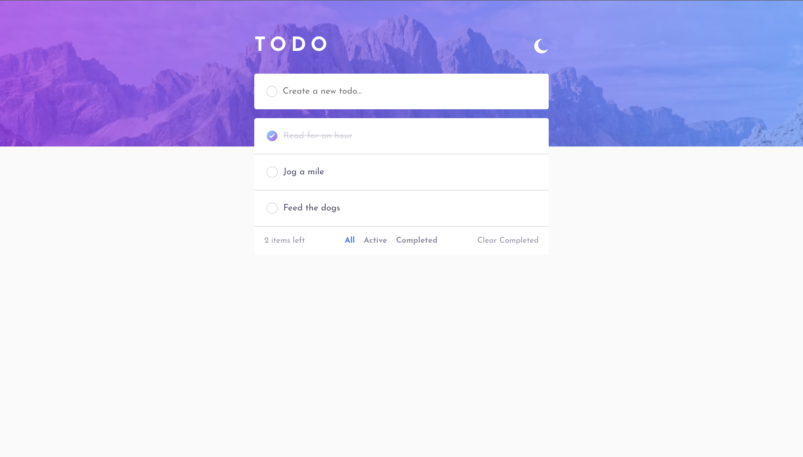
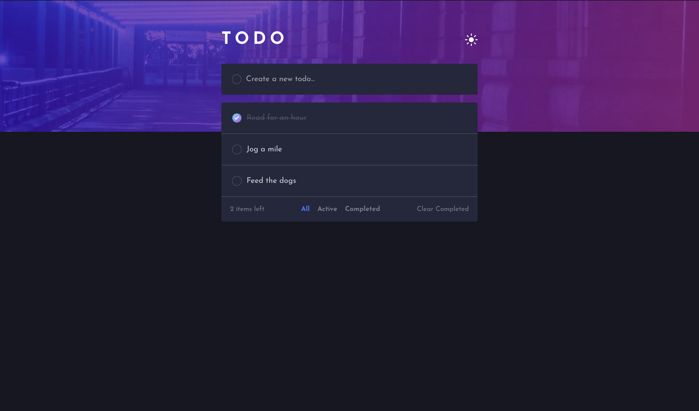

# Todo app solution

This is a solution to the [Todo app challenge on Frontend Mentor](https://www.frontendmentor.io/challenges/todo-app-Su1_KokOW). Frontend Mentor challenges help you improve your coding skills by building realistic projects.

## Table of contents

- [Overview](#overview)
  - [The challenge](#the-challenge)
  - [Screenshot](#screenshot)
  - [Links](#links)
  - [Built with](#built-with)
- [Author](#author)

## Overview

### The challenge

Users should be able to:

- View the optimal layout for the app depending on their device's screen size
- See hover states for all interactive elements on the page
- Add new todos to the list
- Mark todos as complete
- Delete todos from the list
- Filter by all/active/complete todos
- Clear all completed todos
- Toggle light and dark mode

### Screenshots

 

### Links

- Solution URL: [Solution URL here](https://github.com/irinebthayil/todo-app)
- Live Site URL: [Live site URL here](http://irinebthayil.github.io/todo-app)

### Built with

- [React](https://reactjs.org/) - JS library
- Flexbox
- Mobile-first workflow

## Author

- Github - [Irine B Thayil](https://github.com/irinebthayil)
- Frontend Mentor - [@irinebthayil](https://www.frontendmentor.io/profile/irinebthayil)
- LinkedIn - [Irine B Thayil](https://www.linkedin.com/in/irinebthayil/)